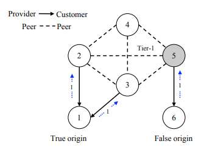

# Prefix Hijack Attack
This project explores the vulnerabilities of BGP by simulating a BGP hijack. For the sake of simpilicity, each host acts as an AS, runs a routing daemon, uses BGP to communicate with other ASes, and configures its own isolated st of routing entries in the kernel. Each host has its own IP address, which is the IP address of its border router.
 
I created the configuration files in `./conf` to model the following topology, where AS6 is the malicious AS that will mount the attack through false BGP advertisements. The attack is implemented in `bgp.py`:

## How to run
1. Run `sudo python bgp.py`
2. Open another terminal and run `./connect.sh`
3. Enter `en` three times to bypass verification
4. Run `sh ip bgp`
5. Open another terminal and run `./website.sh`
6. Open another terminal and run `./start_rogue.sh` to begin the attack

To stop the attack, run `./stop_rogue.sh`

## Assumptions
* All links are bidirectional peering links
* Each AS/host advertises a single prefix (AS1: 1.0.0.0/8, AS2: 2.0.0.0/8, AS3: 3.0.0.0/8, AS4: 4.0.0.0/8, AS5: 5.0.0.0/8, AS6: 1.0.0.0/8)

## Environment
* Packages/daemons: Quagga, bgpd, Zebra
* mininet
* Ubuntu 14.04 LTS
